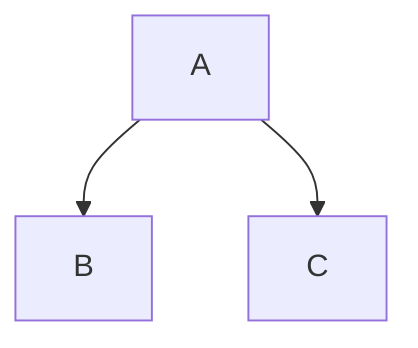

% Markdown形式のファイルをpdfに変換する
 pandoc
% 五十嵐 浩人
% 2017年3月5日

# Markdown形式のファイルをpdfに変換する

## Markdownとは
Markdownはジョン・グルーバーさんが作成しました。どんなものかはウィキペディアからの引用します。

>Markdown（マークダウン）は、文書を記述するための軽量マークアップ言語のひとつである。本来はプレーンテキスト形式で手軽に書いた文書からHTMLを生成するために開発されたものである。しかし、現在ではHTMLのほかパワーポイント形式やLATEX形式のファイルへ変換するソフトウェア（コンバータ）も開発されている。各コンバータの開発者によって多様な拡張が施されるため、各種の方言が存在する。

このドキュメントでは上記の各コンバータのうち、HTMLに変換するvim-markdownとpdfに変換するpandocについて記述します。

## パソコンの環境を確認する

Ubuntuの場合、以下のコマンドでOSのバージョンを確認します。

~~~
$ cat /etc/lsb-release
DISTRIB_ID=Ubuntu
DISTRIB_RELEASE=16.10
DISTRIB_CODENAME=yakkety
DISTRIB_DESCRIPTION="Ubuntu 16.10"
~~~

アーキテクチャも確認します。

~~~
$ arch
x86_64
~~~

vimのバージョンも確認しておきます。

~~~
$ vim --version
VIM - Vi IMproved 7.4 (2013 Aug 10, compiled Nov 24 2016 22:32:42)
適用済パッチ: 1-1829
追加拡張パッチ: 8.0.0056
~~~

## Markdownの編集環境を設定する

### vimにVOoMをインストールする

VOoM(Vim Outliner of Markups)はマークアップされたテキスト用のアウトライナーです。
最新版のダウンロードは [VOoM : Vim two-pane outliner](http://www.vim.org/scripts/script.php?script_id=2657) から行いました。

バージョンは5.2以上が必要です。5.1以下だとPython3がサポートされていないからです。Ubuntuのターミナルで`apt install vim-voom`でインストールされるバージョンは5.1です。

VOoM-5.2.zipを解凍してできるVOoMディレクトリの下のautoload、doc、pluginを~/.vimの下にコピーすることでvimから使用することが出来ます。

### VOoMを使ってみる

Markdown形式のファイルをvimで開いている状態で`:Voom markdown`とコマンドを入力します。

他に使えるコマンドには`:Voomhelp`、`:Voomexec`、`Voomlog`があるようですがまだ使ったことはありせん。

VOoMはtwo-pane outlinerと説明されていますので左側に表示される部分をペインと呼ぶことにします。その左側のペインにはMarkdownで見出しとして記述されたものがツリーとして表示されています。

左側のペインと右側のペインを移動するには&lt;tab>キーを使います。

### vim-markdownの設定

## pandocの設定

### pandocとは

pandocのホームページは[Pandoc a universal document conver](http://pandoc.org)です。

マークアップされたテキストを他の形式に変換するためのツールです。

### LaTeXの環境をインストールする

日本語を扱うためにはLuaLaTexが必要になります。インストールは下記のコマンドで行います。

~~~
sudo apt install texlive-luatex texlive-lang-cjk lmodern texlive-xetex
~~~

### pandocをインストールする
[Pandoc a universal document conver](http://pandoc.org/installing.html)のダウンロードページからダウンロードします。
Ubuntu用には拡張子がdebのファイルをダウンロードします。pandoc-1.19.2.1-1-amd64.debです。
インストールは以下のコマンドで行います。

~~~
sudo dpkg -i pandoc-1.19.2.1-1-amd64.deb
~~~

## Markdownの構文
Markdownにはいくつかの拡張された構文があります。このドキュメントではhtmlへの変換とpandocによるpdfへの変換がうまくいくMarkdownの構文に限定して説明します。

### 文字エンティティを使用する特殊文字
&amp;と&lt;は文字エンティティで記述する必要があります。
&amp;は
```
&amp;
```

&lt;は
```
&lt;
```
と記述します。

著作権記号&copy;を記述するときは
```
&copy;
```
と記述します。

## ブロック要素の構文

### 段落と改行
段落は段落の後ろで改行します。htmlに変換されると段落が&lt;p>と&lt;/p>で囲まれるようになります。

改行は改行する行末にスペースを2つ以上いれます。htmlに変換されると行末のスペース2つが&lt;br>に変換されるようになります。

スペースなし
スペースなし

スペースあり  
スペースあり


### ヘッダ
ヘッダは日本語だと見出しです。

先頭に#記号をつける形式をATX形式のヘッダと呼びます。1〜6個の#記号および1行のテキストを記述します。Pandocには「ヘッダの前に空行を入れる」という制約があります。

    ## レベル2のヘッダ

    ### レベル3のヘッダ

アンダーラインでヘッダを記述するSetex形式も使用できますが#のほうが簡単と思います。

### 引用
先頭に>を記述します。下の例では1行目の行末にスペース2つをいれて改行しています。

>引用1行目  
>引用2行目

### リスト

### コードブロック
複数行のコードは先頭にタブかスペースを4つ以上いれます。タブをスペース2つに設定している場合はタブを2ついれます。htmlに変換されると&lt;pre>タグに囲まれるようになります。

    def main():
      print("Hello World")
  
    if __name__ == '__main__':
      main()

### 水平線
-(ハイフン)、*(アスタリスク)、_(アンダーバー)を3つ以上記述します。上の行には空行をいれます。

ハイフン3つの場合

---

アスタリスク3つの場合

***

アンダーバー3つの場合

___

## インライン要素の構文

### リンク

### 強調
強調したいテキストを\*(アスタリスク)か\_(アンダーバー)で囲みます。htmlに変換されるときは\*か\_が1つの場合は&lt;em>、2つの場合は&lt;strong>で囲まれるようになります。
&lt;em>タグのemはEmphasisの略でブラウザではイタリック体で表示されます。&lt;strong>タグはブラウザではボールド体で表示されます。pandocでpdfに変換したときはどちらもボールドで表示されます。

*強調 イタリックになっているはず*  
_強調 イタリックになっているはず_

**強調 ボールドになっているはず**  
__強調 ボールドになっているはず__

### コード
\`(バッククォート)で囲みます。

普通のテキスト。ここからコード`print("Hello Word")`。ここは普通のテキスト。

### イメージ

## その他

### 自動リンク

### バックスラッシュエスケープ
Markdownでは下に示す特殊文字を使うときには、バックスラッシュでエスケープしたほうが良いようです。

特殊文字の一覧


|特殊文字|読み|
|--------|----|
|\\|バックスラッシュ|
|\`|バッククォート|
|\*|アスタリスク|
|\_|アンダーバー\(アンダースコア\)|
|\{\}|中括弧|
|\[\]|角括弧|
|\(\)|括弧|
|\>|大なり記号|
|\#|シャープ記号|
|\+|プラス記号|
|\-|ハイフン|
|\.|ピリオド|
|\!|感嘆符|

## 拡張の構文

### 表
pandocでは4種類の表が使用できます。以下の4つです。

* シンプルテーブル
* マルチラインテーブル
* グリッドテープル
* パイプテーブル

パイプテーブルで試してみます。

|右寄せ | 左寄せ|デフォルト|中央寄せ|
|------:|:------|----------|:------:|
| 12   | 12   | 12       | 12     |
| 123  | 123  | 123      | 123    |
| 1    | 1    | 1        | 1      |


### タイトルブロック
タイトルブロックはpandocの拡張です。
pdfの先頭にタイトルをつけたい場合はファイルの先頭に%で始まるタイトルブロックを記述します。

~~~
% タイトル
% 著者(複数の場合はセミコロンで区切る)
% 日付
~~~

タイトルを複数行にしたい場合は2行目以降の先頭にスペースを入れます。

~~~
% タイトル
 副タイトル
~~~

### グラフの描画
mermaidで試してみましたが、Chromeがバージョン48から仕様を変えたようで線が描画できませんでした。




## pandocでpdfに変換する

### pandocの実行
下の例ではオプションとして-Nと--tocをつけています。

* -Nは見出しに章番号をつけるオプション
* --tocは文書の最初に目次をつけるオプション

~~~
pandoc README.md -o README.pdf -V documentclass=ltjarticle --latex-engine=lualatex --toc -N
~~~

### pdfの表示
ブラウザで表示させても良いですし、Ubuntuのコマンドラインから

```bash
evince README.pdf
```

でも良いです。
