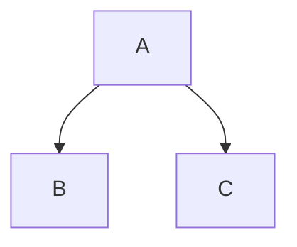

% Markdown形式のファイルをPDFファイルに変換する
 pandoc
% 五十嵐 浩人
% 2017年3月5日

# Markdown形式のファイルをPDFファイルに変換する

## Markdownとは
Markdownはジョン・グルーバーさんが作成しました。ジョン・グルーバーさんのサイト[DARING FIREBALL](http://daringfireball.net/projects/markdown/)が参考になります。  
下はウィキペディアからの引用です。

>Markdown（マークダウン）は、文書を記述するための軽量マークアップ言語のひとつである。本来はプレーンテキスト形式で手軽に書いた文書からHTMLを生成するために開発されたものである。しかし、現在ではHTMLのほかパワーポイント形式やLATEX形式のファイルへ変換するソフトウェア（コンバータ）も開発されている。各コンバータの開発者によって多様な拡張が施されるため、各種の方言が存在する。

このドキュメントでは上記の各コンバータのうち、MarkdownをHTMLに変換してプレビューする[previm](https://github.com/kannokanno/previm)とMarkdown形式をPDF形式に変換する[pandoc](http://pandoc.org/)について記述します。

## パソコンの環境を確認する

Ubuntuの場合、以下のコマンドでOSのバージョンを確認します。

~~~
$ cat /etc/lsb-release
DISTRIB_ID=Ubuntu
DISTRIB_RELEASE=16.10
DISTRIB_CODENAME=yakkety
DISTRIB_DESCRIPTION="Ubuntu 16.10"
~~~

アーキテクチャも確認します。

~~~
$ arch
x86_64
~~~

vimのバージョンも確認しておきます。

~~~
$ vim --version
VIM - Vi IMproved 7.4 (2013 Aug 10, compiled Nov 24 2016 22:32:42)
適用済パッチ: 1-1829
追加拡張パッチ: 8.0.0056
~~~

## Markdownの編集環境を設定する

### vimでMarkdownを編集するためのプラグイン
vim用のプラグインを列挙します。

* vim-markdown [Markdown Vim Mode](https://github.com/plasticboy/vim-markdown)
* previm [Realtime preview Vim.](https://github.com/kannokanno/previm)
* open-browser.vim [Open URI with your favorite browser from your most favorite editor](https://github.com/tyru/open-browser.vim)

~/.vimrcファイルに以下を記入します。
NeoBundleを使っているのが前提です。
~~~
" Markdownの環境
NeoBundle 'godlygeek/tabular'
NeoBundle 'plasticboy/vim-markdown'
NeoBundle 'kannokanno/previm'
NeoBundle 'tyru/open-browser.vim'
~~~

`:w`で保存して`:so ~/.vimrc`で再読み込みして`:NeoBundleInstall`でインストール完了です。

### vimにアウトライナーVOoMをインストールする
VOoM(Vim Outliner of Markups)はマークアップされたテキスト用のアウトライナーです。
便利そうなのでインストールして使っています。  
最新版のダウンロードは [VOoM : Vim two-pane outliner](http://www.vim.org/scripts/script.php?script_id=2657) から行いました。

バージョンは5.2以上が必要です。5.1以下だとPython3がサポートされていないからです。Ubuntuのターミナルで`apt install vim-voom`でインストールされるバージョンは5.1です。

VOoM-5.2.zipを解凍してできるVOoMディレクトリの下のautoload、doc、pluginを~/.vimの下にコピーすることでvimから使用することが出来ます。

### VOoMを使ってみる

Markdown形式のファイルをvimで開いている状態で`:Voom markdown`とコマンドを入力します。

他に使えるコマンドには`:Voomhelp`、`:Voomexec`、`Voomlog`があります。

VOoMはtwo-pane outlinerと説明されていますので左側に表示される部分をアウトラインのペインと呼ぶことにします。そのアウトラインのペインにはMarkdownで見出しとして記述されたものがツリーとして表示されています。

アウトラインのペインと右側のペインを移動するには&lt;tab>キーを使います。  
アウトラインのペインでハイライトされている見出しを編集する時はコントロールキーを押しながら矢印キーを使います。移動させたいときは上矢印キーか下矢印キー、階層を変えたいときは右矢印キーか左矢印キーです。

ツリーを折り畳みたい時は、`za`を使います。

## pandocの設定

### pandocとは

pandocのホームページは[Pandoc a universal document conver](http://pandoc.org)です。

マークアップされたテキストを他の形式に変換するためのツールです。

### LaTeXの環境をインストールする

日本語を扱うためにはLuaLaTexが必要になります。インストールは下記のコマンドで行います。

~~~
sudo apt install texlive-luatex texlive-lang-cjk lmodern texlive-xetex
~~~

### pandocをインストールする
[Pandoc a universal document conver](http://pandoc.org/installing.html)のダウンロードページからダウンロードします。
Ubuntu用には拡張子がdebのファイルをダウンロードします。pandoc-1.19.2.1-1-amd64.debです。
インストールは以下のコマンドで行います。

~~~
sudo dpkg -i pandoc-1.19.2.1-1-amd64.deb
~~~

## Markdownの構文
Markdownには各種の方言があります。このドキュメントではhtmlへの変換とpandocによるPDF形式への変換がうまくいくMarkdownの構文に限定して説明します。

### 文字エンティティを使用する特殊文字
&amp;と&lt;は文字エンティティで記述する必要があります。
&amp;は

```
&amp;
```

&lt;は

```
&lt;
```
と記述します。

著作権記号&copy;を記述するときは

```
&copy;
```
と記述します。

## ブロック要素の構文

### 段落と改行
段落は段落の後ろで改行します。htmlに変換されると段落が&lt;p>と&lt;/p>で囲まれるようになります。

改行は改行する行末にスペースを2つ以上いれます。htmlに変換されると行末のスペース2つが&lt;br>に変換されるようになります。

Markdown:

```
スペースなし
スペースなし
```

ブラウザの出力:

スペースなし
スペースなし

Markdown:

```
スペースあり  
スペースあり
```

ブラウザの出力:

スペースあり  
スペースあり


### ヘッダ
ヘッダは日本語だと見出しです。

先頭に#記号をつける形式をATX形式のヘッダと呼びます。1〜6個の#記号および1行のテキストを記述します。Pandocには「ヘッダの前に空行を入れる」という制約があります。

    ## レベル2のヘッダ

    ### レベル3のヘッダ

アンダーラインでヘッダを記述するSetex形式も使用できますが#のほうが簡単と思います。

### 引用
先頭に>を記述します。下の例では1行目の行末にスペース2つをいれて改行しています。

Markdown:

```
>引用1行目  
>引用2行目
```

ブラウザの出力:

>引用1行目  
>引用2行目

### リスト

#### 箇条書きのリスト
箇条書きのリストは、アスタリスク、プラス、ハイフン（*、+、 - ）を先頭に記述します。

Markdown:

```
* りんご
* いちご
* バナナ
```

ブラウザの出力:

* りんご
* いちご
* バナナ

Markdown:

```
+ りんご
+ いちご
+ バナナ
```

ブラウザの出力:

+ りんご
+ いちご
+ バナナ

Markdown:

```
- りんご
- いちご
- バナナ
```

ブラウザの出力:

- りんご
- いちご
- バナナ

#### 番号付きのリスト
番号付きのリストは、行の先頭に番号を記述し、その後にピリオドを続けます。前の行は空行である必要があります。

Markdown:

```
1. りんご
2. いちご
3. バナナ
```

ブラウザの出力:

1. りんご
2. いちご
3. バナナ

リストの項目の間に空白行を置くと、&lt;p>タグに変換されます。空白行に続く段落を4つのスペースまたは1つのタブでインデントすることで、複数の段落があるリスト項目を作成できます。

Markdown:

```
* リストの項目

  複数の段落のリスト項目

* リストの項目
```

ブラウザの出力:

* リストの項目

  複数の段落のリスト項目

* リストの項目

### コードブロック
複数行のコードは先頭にタブかスペースを4つ以上いれます。タブをスペース2つに設定している場合はタブを2ついれます。htmlに変換されると&lt;pre>タグに囲まれるようになります。

    def main():
      print("Hello World")
  
    if __name__ == '__main__':
      main()

### 水平線
\-(ハイフン)、\*(アスタリスク)、\_(アンダーバー)を3つ以上記述します。上の行には空行をいれます。

ハイフン3つの場合

---

アスタリスク3つの場合

***

アンダーバー3つの場合

___

## インライン要素の構文

### リンク

### 強調
強調したいテキストを\*(アスタリスク)か\_(アンダーバー)で囲みます。htmlに変換されるときは\*か\_が1つの場合は&lt;em>、2つの場合は&lt;strong>で囲まれるようになります。
&lt;em>タグのemはEmphasisの略でブラウザではイタリック体で表示されます。&lt;strong>タグはブラウザではボールド体で表示されます。pandocでpdfに変換したときはどちらもボールドで表示されます。

Markdown:

```
*強調 イタリックになっているはず*  
_強調 イタリックになっているはず_
```

ブラウザの出力:

*強調 イタリックになっているはず*  
_強調 イタリックになっているはず_

Markdown:

```
**強調 ボールドになっているはず**  
__強調 ボールドになっているはず__
```

ブラウザの出力:

**強調 ボールドになっているはず**  
__強調 ボールドになっているはず__

### コード
\`(バッククォート)で囲みます。

普通のテキスト。ここからコード`print("Hello Word")`。ここは普通のテキスト。

### イメージ
イメージの構文はリンクと似ています。  
HTML形式に変換されたときには"alt text"は&lt;img>タグのalt属性の値に設定されます。また、"Title"はtitle属性の値に設定されます。title属性の値はマウスオーバーしたときに表示される文字列です。  
PDF形式に変換されたときにはPNGファイルの表示位置の下に図1: "alt text"と展開されます。"Title"は使われていないようです。  
また改ページの近くにイメージが表示されるときは表示の順番が崩れる場合があるので注意する必要があります。

```

```

Markdown:

```

```

ブラウザの出力:


HTML:
```

```

## その他

### 自動リンク

### バックスラッシュエスケープ
Markdownでは下に示す特殊文字を使うときには、バックスラッシュでエスケープしたほうが良いようです。

特殊文字の一覧


|特殊文字|読み|
|--------|----|
|\\|バックスラッシュ|
|\`|バッククォート|
|\*|アスタリスク|
|\_|アンダーバー\(アンダースコア\)|
|\{\}|中括弧|
|\[\]|角括弧|
|\(\)|括弧|
|\>|大なり記号|
|\#|シャープ記号|
|\+|プラス記号|
|\-|ハイフン|
|\.|ピリオド|
|\!|感嘆符|

## 拡張の構文

### 表
pandocでは4種類の表が使用できます。以下の4つです。

* シンプルテーブル
* マルチラインテーブル
* グリッドテープル
* パイプテーブル

パイプテーブルで試してみます。

Markdown:

```
|右寄せ | 左寄せ|デフォルト|中央寄せ|
|------:|:------|----------|:------:|
| 12    | 12    | 12       | 12     |
| 123   | 123   | 123      | 123    |
| 1     | 1     | 1        | 1      |
```

ブラウザの出力:

|右寄せ | 左寄せ|デフォルト|中央寄せ|
|------:|:------|----------|:------:|
| 12   | 12   | 12       | 12     |
| 123  | 123  | 123      | 123    |
| 1    | 1    | 1        | 1      |


### タイトルブロック
タイトルブロックはpandocの拡張です。
pdfの先頭にタイトルをつけたい場合はファイルの先頭に%で始まるタイトルブロックを記述します。

~~~
% タイトル
% 著者(複数の場合はセミコロンで区切る)
% 日付
~~~

タイトルを複数行にしたい場合は2行目以降の先頭にスペースを入れます。

~~~
% タイトル
 副タイトル
~~~

### グラフの描画
mermaidで試してみましたが、Chromeがバージョン48から仕様を変えたようで線が描画できませんでした。




## pandocでpdfに変換する

### pandocの実行
下の例ではオプションとして-Nと--tocをつけています。

* -Nは見出しに章番号をつけるオプション
* --tocは文書の最初に目次をつけるオプション

~~~
pandoc README.md -o README.pdf -V documentclass=ltjarticle --latex-engine=lualatex --toc -N
~~~

### pdfの表示
ブラウザで表示させても良いですし、Ubuntuのコマンドラインから

```bash
evince README.pdf
```

でも良いです。

